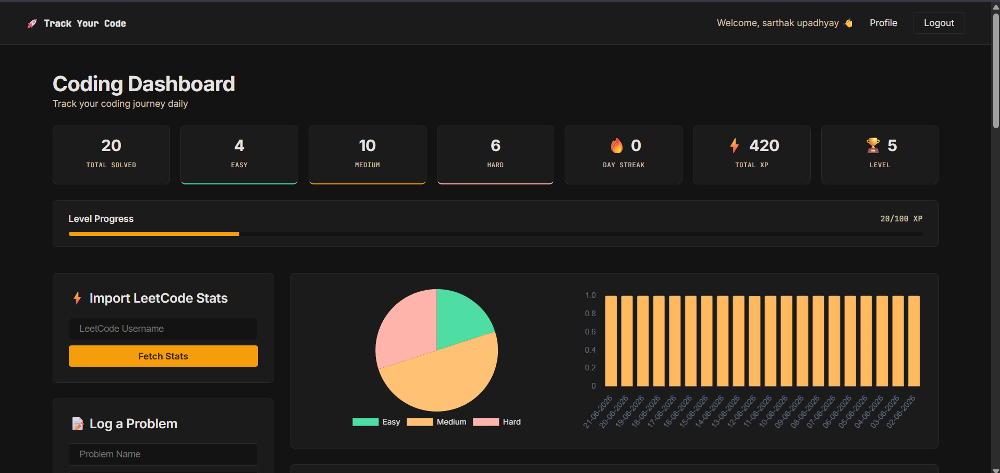
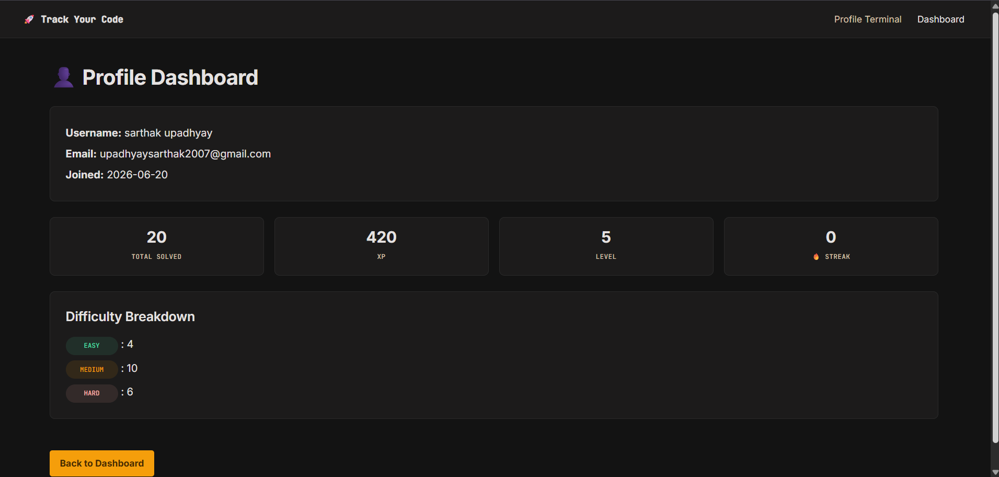
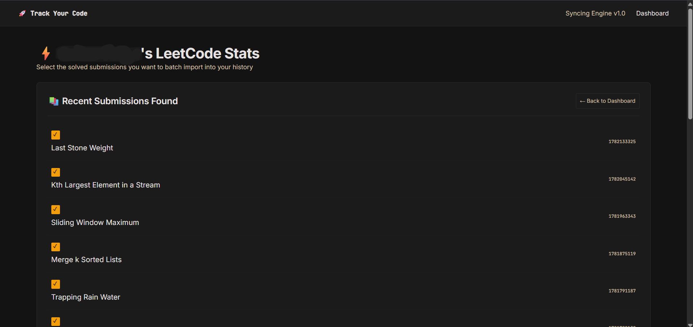

# 🚀 Coding Tracker

A full-stack Flask web application that helps programmers track coding practice, maintain streaks, earn XP, and import solved problems from LeetCode.

## 🌐 Live Demo

(https://track-your-code.onrender.com)

## 📸 Screenshots

### Dashboard

### Profile Page

### LeetCode Import

---

## ✨ Features

* 🔐 User Authentication (Register/Login)
* 🔒 Secure password hashing
* 📈 Coding progress dashboard
* 🔥 Daily streak tracking
* ⭐ XP and leveling system
* 🏆 Achievement badges
* 📊 Problem statistics by difficulty
* 👤 User profile page
* 📥 Import accepted submissions from LeetCode
* ☁️ PostgreSQL database
* 🚀 Deployed on Render

---

## 🛠️ Tech Stack

### Backend

* Flask
* PostgreSQL
* Psycopg2

### Frontend

* HTML
* CSS
* Jinja2 Templates

### Other Tools

* LeetCode GraphQL API
* Render
* Git & GitHub

---

## 📂 Project Structure

coding-tracker/

├── app.py

├── database.py

├── templates/

├── static/

│   └── style.css

├── requirements.txt

├── Procfile

└── README.md

---

## ⚙️ Installation

Clone the repository:

git clone https://github.com/YOUR_USERNAME/YOUR_REPO.git

cd YOUR_REPO

Install dependencies:

pip install -r requirements.txt

Create a .env file:

SECRET_KEY=your_secret_key

DATABASE_URL=your_database_url

Run the application:

python app.py

---

## 🎯 What I Learned

During this project I learned:

* Flask web development
* Authentication and sessions
* Password hashing
* PostgreSQL database integration
* SQL query design
* API integration with LeetCode
* Deployment using Render
* Git and GitHub workflows
* Debugging production issues

---

## 🚀 Future Improvements

* Better mobile responsiveness
* Dark/Light mode toggle
* Faster LeetCode imports
* Data visualizations
* Weekly and monthly progress reports

---

## 👨‍💻 Author

Sarthak Upadhyay
